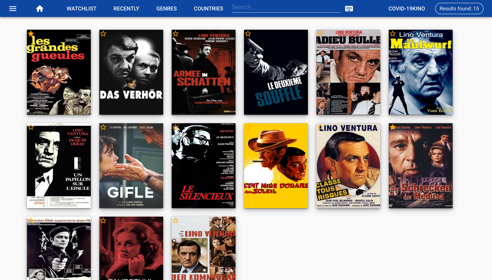

# movielite

**movielite** is a simple **personal movie database**, written in golang and VUE.js.


You can specify local directories watched for new movies. If new movies found metadata and images added form TMDB. [TMDB](https://www.themoviedb.org).



## Features

* List your movies with metadata
* Search movies by title, description and persons
* Play movies with you local player
* View detail movie info
* Automatically add new movies and add the metadata
* Uses sqlite no db server required
* Wachtlist
* Download movies
* Move movies to desired directory

## Getting Started (Demo)
- Clone the Repository
- Run in this directory: docker-compose up
- Goto http://localhost:8000/movie2/
You will see some example data without media files.
## Installation
- Get the API Key from https://developers.themoviedb.org/3/

- Clone Repository ```git clone https://github.com/ms900ft/movielite.git ```
- Genarte

```
    # install npm packages
    make npminstall
    # build single binary
    make
```
You find the binary "movelite" in the directory root

The main configuration file is movielite.yaml, but it is not included by default. Simply make a copy of movielite.yaml.tmpl and rename it to movielite.yaml. See example_movielite.yaml for more information about configurations.

````
# devel, prod
Mode: prod
# Port to run
Port: 8000
# Enable sql debugging
SQLDebug: false
# Language to get Metadata
Language: "en-US"
# Location of the sqlite database
Database:
  Dbname: "./movielite.db"

# Player to play movies default is vlc (optional)
# Player: "QuickTime Player"


TMDB:
  # Your API key. Without API key you can't get metadata from tmdb
  ApiKey: #add your api key
  # Directory for the image cache.
  ImageDir: ./images

# Base directory of your movie lib.
TargetDirectory: ./movies

# URL of this server
MovieServerUrl: http://localhost:8000

# Use system trash instead of delete
TrashCan: true

#Watch here for new movies
WatchDir: "./movies/new"

# Additional regex's to find movie name in filename
# Key is only for debugging. Build in can be found in
# models/files.go
FilterRegEx:
  OTR: ^(.+?)_\d{2}\.\d{2}\.\d{2}_\d{2}-\d{2}_
  MT: ^.+?-(.+?)-\d+-\d+
  MT_Zdf: ^.+?-(.+?)_-
  MT_ZDF_SEASON: ^.+?-(.+?)_\((\d+)\)-\d+_\w+_\d+

# enable webdav (admin/test123)
WebDav: true
````
### Start server

````
./movielite start
````
 Now browse to the app at http://localhost:8000/movie2 .

 If you use the default config a watcher is set on the directory **./example/movies**.
 To add a new movie copy the movie in the watched folder.

### Add your library
The server must be running. To add you existing movies to movielite type
`````
movielite scan -d [directory to scan]
`````